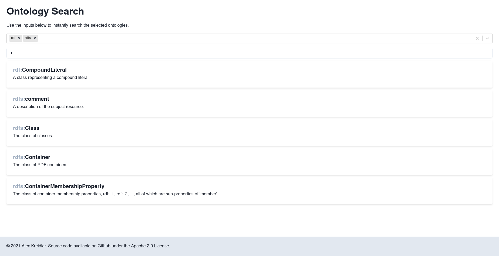

# OntologySearch

[View the online demo app](https://ontologysearch.netlify.app/)

A completely browser-based search tool for the most common ontologies.

The tool performs full text search on the labels and common descriptions, including:
- `rdfs:label`
- `rdfs:comment`
- `skos:prefLabel`
- `skos:notation`

You can also copy the IRI of each item by clicking on it.

Powered by a few of the following technologies:
- FlexSearch
- `@zazuko/rdf-vocabularies`
- `clownface`
- Chakra UI

TODOs:
- Add more details to display: Types?
- Add links to IRIs? Maybe only for some?
- Investigate the UI blocking when creating an index takes a long time.
- Add a graph visualization?